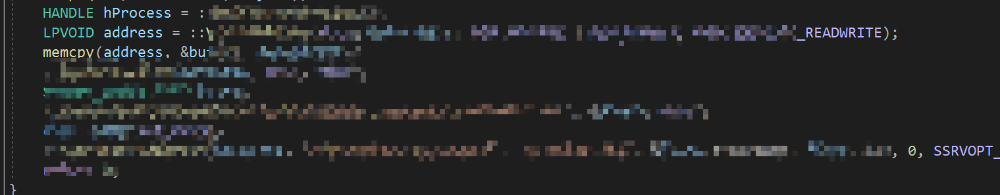
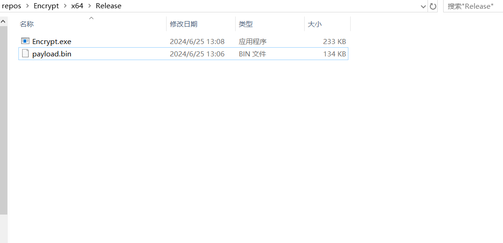
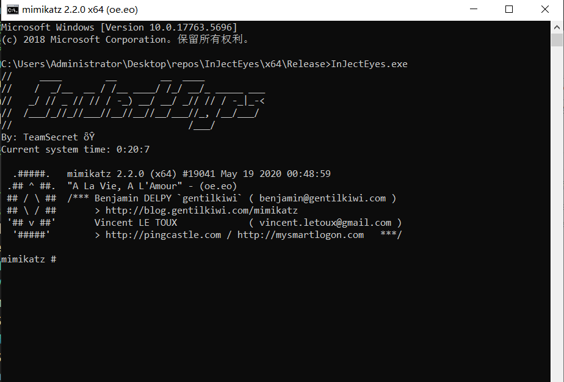
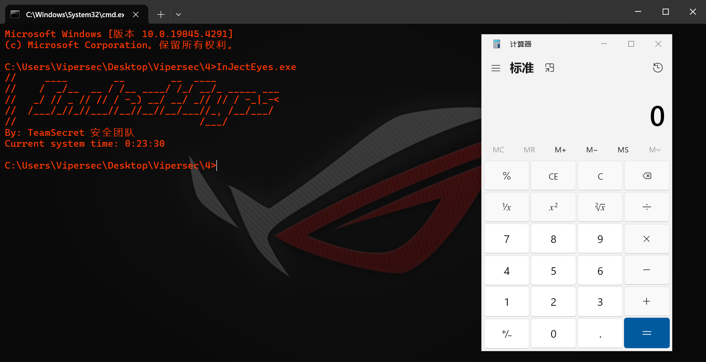
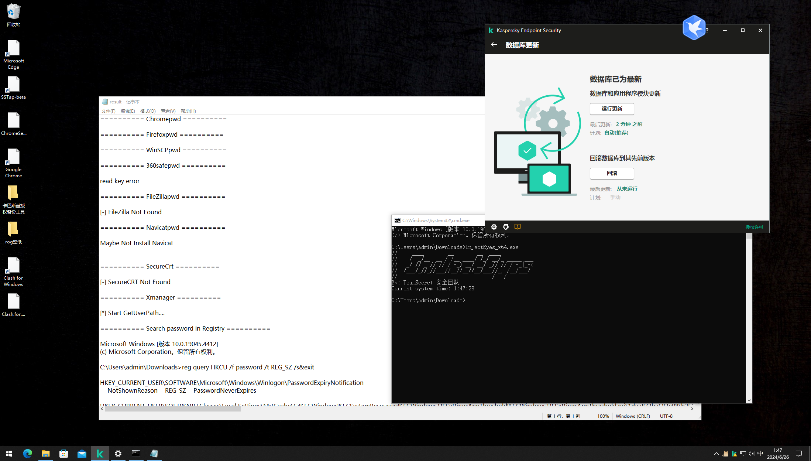
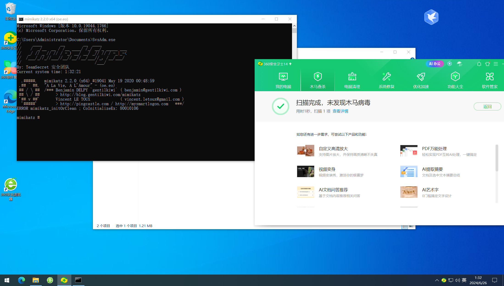
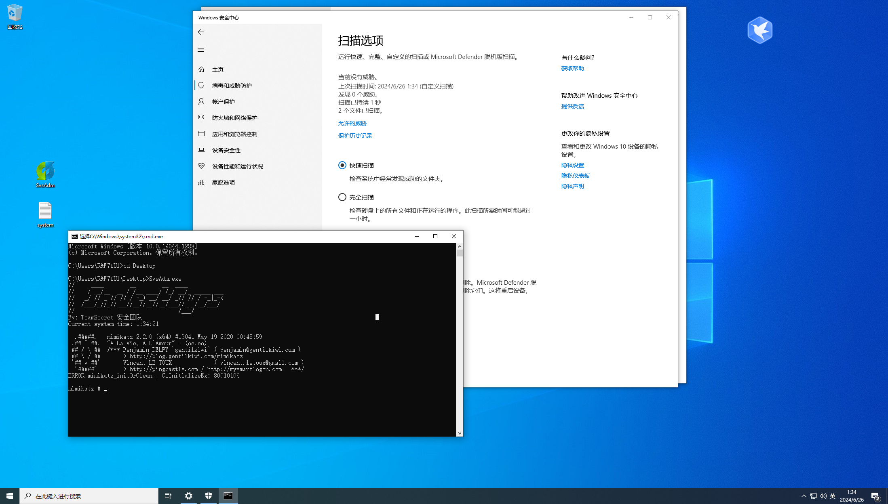

# InJectEyes

## 免责声明

本文仅用于技术讨论与学习，利用此文所提供的信息而造成的任何直接或者间接的后果及损失，均由使用者本人负责，文章作者及本公众号团队不为此承担任何责任。传播、利用本文章所提供的信息而造成的任何直接或者间接的后果及损失，均由使用者本人负责，作者不为此承担任何责任，一旦造成后果请自行负责。

<br/>

## 工具简介

解决了Hvv和渗透期间，工具落地被杀，执行不起来，或跑起来被杀的场景。TeamSecret安全团队致力于解决实战场景中遇到的各种各样问题。让你在打点后平步青云。

使用代码： **C++**

使用Loader：**回调函数，未公开的隐秘Loader**

加壳：InjectEyes.exe 已经加壳使用



使用场景：打点完成后，或钓鱼捆绑马使用。此工具可以**捆绑 工具   木马【x64对应x64RAW】、【x86对应x86RAW】**。

目的：让脚本小子在内网遨游无忧无虑。

<br/>

## 使用方法

### 步骤一：

加载成型exe工具：

```
pe2shc.exe fsan.exe  payload.bin
```

将payload.bin和Encrypt.exe放置同目录



### 步骤二 混淆

Encrypt.exe 此程序仅用于混淆生成system.log文件，可能存在报毒(c++你懂的) 添加白名单or虚拟机断网使用都可以。

```
Encrypt.exe
```

生成  system.log

### 步骤三 运行

将 InJectEyes.exe 和 system.log放置同目录，在cmd下运行

```
InJectEyes.exe
```



<br/>



### 三、AV

### avp 卡巴斯基

<br/>



<br/>

### 360QVM



<br/>

<br/>

### Defender


